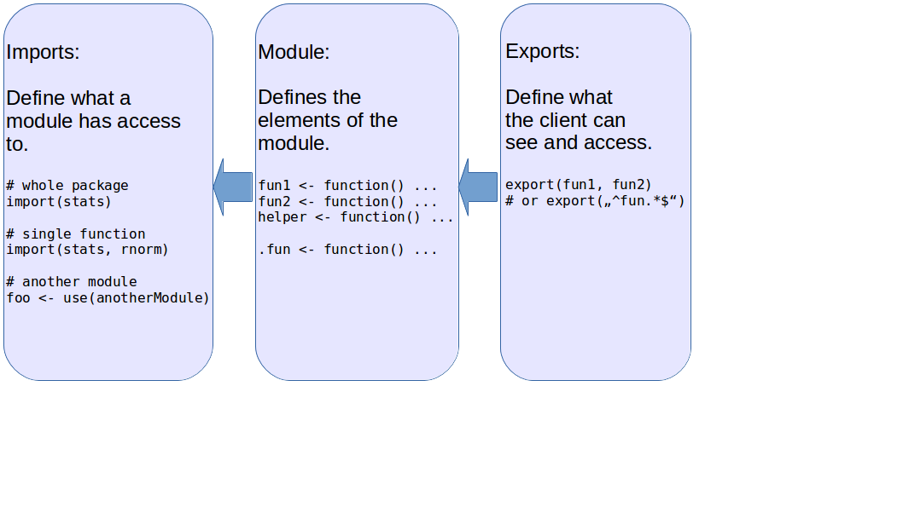

```{r setup, include=FALSE}
knitr::opts_chunk$set(echo = FALSE)
```


## Example 

<div class="columns-2">

### Maybe a problem
```{r echo = TRUE, error=TRUE, tidy=FALSE, eval = FALSE}
#


helper <- function(x) rnorm(x)
fun <- function(x) helper(x)


library("parallel")
cl <- makeCluster(2)
clusterMap(cl, fun, 1:2)
stopCluster(cl)
```


### One solution
```{r echo = TRUE, message=FALSE, eval = FALSE}

library("modules")
m <- module({
  
  import("stats", "rnorm")
  
  helper <- function(x) rnorm(x)
  fun <- function(x) helper(x)
  
})

library("parallel")
cl <- makeCluster(2)
clusterMap(cl, m$fun, 1:2)
stopCluster(cl)
```

</div>

## Example

<div class="columns-2">
### Missing dependency


### Scoping with modules


</div>

## Basics




## Use case: scripts {.smaller}

<div class="columns-2">
### Out-sourcing functions

```{r echo = TRUE, error=TRUE, tidy=FALSE, eval = FALSE}
# Instead of:
source("functions.R")
fun()

# we can write
m <- modules::use("functions.R")
m$fun()
```


### `functions.R`
```{r echo = TRUE, message=FALSE, eval = FALSE}
import("somePackage", "someFunction")
export("fun")

doSomethingWith <- function(x) ...

fun <- function(x = NULL) {
  doSomethingWith(x)
}
```

</div>


## Use case: functions {.smaller}

<div class="columns-2">
### Function with side-effect

```{r echo = TRUE, error=TRUE, tidy=FALSE, eval = FALSE}
plotFun <- function(data, ...) {
  
  library("ggplot2")
  
  ggplot(data, aes(...)) + 
    geom_boxplot() +
    ...
  
}
```

### Alternative
```{r echo = TRUE, message=FALSE, eval = FALSE}
plotFun <- function(data, ...) {
  
  modules::import("ggplot2")
  
  ggplot(data, aes(...)) + 
    geom_boxplot() +
    ...
  
}
```
</div>


## Use case: organization

```{r echo = TRUE, error=TRUE, tidy=FALSE, eval = FALSE}
mathStuff <- module({
  
  add <- function(x, y) x + y
  subtract <- function(x, y) x - y
  
  usefulAbstractions <- module({
    
    add1 <- function(x) add(x, 1)
    
  })
  
})
```


## Summary

- Scripting: Managing dependencies in scripts
    - Alternative to `library` and `pkg::fun`
    - Across several files
- Programming: Organizing similar functions into modules
- Education: Having an intermediate level between scripts and R-packages


## Want more?

- `modules` is on GitHub
    - [github.com/wahani/modules](https://www.github.com/wahani/modules)
    - (CRAN: `install.packages("modules")`)
    - Just file an issue / make a pull request
    - It has a vignette / Readme


- The Presentation is also in GitHub
    - [github.com/wahani/presiModules](https://www.github.com/wahani/presiModules)

- sebastian.warnholz@inwt.de
